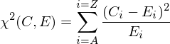

## Vegenere cipher

The Vigenere cipher is a method of encryption originally described by Giovan Battista Bellaso in 1553. It was considered unbreakable for three centuries. During the American civil war it was used by the Confederate States of America. Finally in 1863 a German commander of a National Guard battalion, Friedrich Kasiski, published a book on cryptography called Die Geheimschriften und die Dechiffrir-Kunst ("Secret writing and the Art of Deciphering") that detailed a procedure for attacking the cipher. Unfortunately the significance of this text was not realised for many years. Even as late as 1917, Scientific America described the cipher as "impossible of translation".

### How does the cipher work?

The Vigenere cipher is based on a cipher originally used by Julius Caesar called the Caesar cipher. It was considered secure largely due to the fact that most of Caesar's enemies would have been illiterate. The Caesar cipher works by a simple substitution process of replacing each letter in the plaintext by a letter a fixed number of positions down the alphabet. For instance, with a shift of 2:

plaintext: 'ABC'  
ciphertext: 'CDE'  

Decryption is the process of shifting each letter back by the original forward shift, in this case 2 places. If the shift is unknown, there are only a limited number of characters in the alphabet through which to cycle.

The Vegenere cipher consists of several Caesar ciphers in sequence, each with different shift values. A brute force attack is therefor not possible by shifting through each letter of the alphabet. The shift values of the Caesar ciphers are determined by a keyword. For instance, if we wanted to encrypt the text "SEND IN THE NINJAS" with the key "KNIFE", we would repeat the key so that each letter in the plaintext had a corresponding letter in the key. For instance:

Plaintext:  SEND IN THE NINJAS  
Key:        KNIF EK NIF EKNIFE

Encryption is then a matter of shifting the plaintext letter forward by the position in the alphabet of the corresponding letter of the key.

Ciphertext: CRVI MX GPJ RSARFW


### Breaking the cipher

The first step is to discover the length of the key used to encrypt the text. To do this, we divide the cipher text into columns. First one column, then two columns, and so on. Each column matrix corresponds to a key length. The matrix with the same number of columns as the key will be a matrix where each column is encrypted with the same letter. For example, the ciphertext 'CRVIMXGPJRSARFW' has a 5 letter key which creates 5 Caesar ciphers and can be viewed as follows:

C R V I M  
X G P J R  
S A R F W  

To determine the correct key length, this application makes use of a technique called the index of coincidence (IC). This is a measure of how likely it is to draw two matching letters by randomly selecting two letters from a given text, in this case the columns of the matrix. The function can be expressed as follows:


Where c is the normalising coefficient (26 for English), n<sub>a</sub> is the number of times the letter "a" appears in the text, and N is the length of the text.

If all the letters of a given text were equally distributed, the index would be 1.0. For English text, this value is about 1.73, reflecting the uneven letter distribution of the language. Therefor, if the original message was in English, iterating through matrices of increasing size, the matrix with the IC value closest to 1.73 indicates that the text was encrypted with a key size equal to the number of columns in the matrix.

The next step is to decrypt each column or Caesar cipher. As there are only 26 possible options (26 letters in the alphabet), a brute force attack is simple and quick to perform. The correct letter shift will result in text with the same letter frequency occurrence as English text. The easiest way to do this is by using the Chi-squared statistic. This is a measure of how similar two probability distributions are. The formula is as follows:



Where C<sub>A</sub> is the number of occurrences of letter A and E<sub>A</sub> is the expected count of letter A in normal English text.

Identical distributions produce a Chi-squared statistic of zero, and increasingly different distributions produce an increasingly higher result. By mapping each shift of the column to a Chi-squared statistic, the text most resembling English language will have the shift with the lowest Chi-squared value. Iterating through each column in this manner will yield each letter of the key.

### Running the tests

go test ./...

### Compilation
```
go build -o vegenere
```

### Usage

Encryption

```
vegenere encrypt -s SOURCEFILE -k KEY
```

Decryption with key

```
vegenere decrypt -s SOURCEFILE -k KEY

```

Decryption without key
```
vegenere decrypt -s SOURCEFILE
```

Extract and show the key
```
vegenere decrypt key -s SOURCEFILE
```


